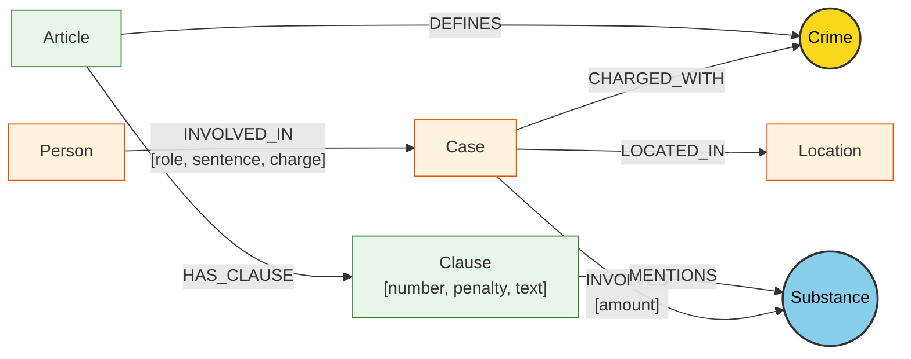

# Thiết kế Ontology — Day 19

**Họ tên:** Đặng Quang Hưng  **MSSV:** 2A202602719

**Lựa chọn** (đánh dấu một):
- [x] Dùng ontology gợi ý (có thể chỉnh nhỏ)
- [ ] Tự thiết kế (xét bonus +15, xem `SUBMISSION.md`)

> Hướng dẫn: `LAB_GUIDE.md` Bước 2. Dùng ontology gợi ý thì vẫn phải điền đủ các mục dưới đây bằng lời của bạn.

## 1. Sơ đồ

Sơ đồ biểu diễn Ontology kết nối hai nguồn tri thức: **Văn bản pháp luật (Law KB)** và **Tin tức xét xử / vụ án (News KB)**. Node cầu nối trung tâm liên kết hai KB là **`Crime`** (Tội danh) và cầu nối phụ là **`Substance`** (Chất ma túy).

*Ghi chú:* 
- Node màu vàng `Crime` là **node cầu nối chính** (primary bridge node).
- Node màu xanh `Substance` là **node cầu nối phụ** (secondary bridge node), xuất hiện ở cả hai KB để hỗ trợ ánh xạ định lượng sang khung hình phạt tại các khoản cụ thể.

---

## 2. Entity types (node labels)

| Label | Ý nghĩa | Khóa định danh (`MERGE` theo) | Properties | Lấy từ KB nào | Trích bằng (regex / LLM / khác) |
| --- | --- | --- | --- | --- | --- |
| `Article` | Đại diện cho một Điều luật trong văn bản quy phạm pháp luật (BLHS, Luật PCMT) | `id` (ví dụ: `"Điều 251 BLHS"`, `"Điều 2 Luật PCMT"`) | `id`, `title`, `law`, `doc_id` | Luật (`drug_law`) | **Regex**: trích từ metadata front-matter và tiêu đề markdown |
| `Clause` | Đại diện cho một Khoản trong Điều luật, chứa quy định chi tiết và khung hình phạt | `id` (ví dụ: `"Điều 251 BLHS khoản 1"`) | `id`, `number`, `penalty`, `text`, `doc_id` | Luật (`drug_law`) | **Regex**: tách khoản theo regex `^(\d+)\.\s`, tìm khung hình phạt bằng regex `\bbị ((?:phạt|tù|cảnh cáo).+?)(?::|$)` |
| `Crime` | Tội danh hình sự chuẩn hóa (cầu nối chính giữa luật và thực tế xét xử) | `name` (chuẩn hóa chữ thường, lược bỏ tiền tố "Tội") | `name` | Cả hai KB (định nghĩa từ luật, trích từ tin tức) | Luật: Regex từ tiêu đề Điều; Tin: LLM trích xuất + chuẩn hóa qua `link_entity` |
| `Substance` | Tên chất ma túy hoặc tiền chất theo danh mục chuẩn | `name` (tên chuẩn hóa, ví dụ: `"MDMA"`, `"Ketamine"`, `"Heroine"`) | `name` | Cả hai KB (quy định trong luật, tang vật trong tin tức) | Luật: Regex so khớp danh mục `SUBSTANCES`; Tin: LLM trích xuất + chuẩn hóa tên |
| `Case` | Vụ án / vụ việc phạm tội hoặc xét xử được phản ánh trong bài báo | `name` (tên rút gọn của vụ việc do LLM gán hoặc fallback về tiêu đề bài) | `name`, `summary`, `date`, `source_title`, `doc_id` | Tin tức (`drug_news`) | **LLM**: trích xuất từ nội dung bài báo (prompt JSON mode) |
| `Person` | Cá nhân tham gia vụ việc (bị cáo, bị can, nghi phạm, người liên quan) | `name` (họ và tên cá nhân đầy đủ) | `name`, `aliases` (danh sách biệt danh như "Hoàng Nato") | Tin tức (`drug_news`) | **LLM**: trích xuất từ nội dung bài báo |
| `Location` | Địa phương, tỉnh/thành phố diễn ra vụ án hoặc nơi tòa án xét xử | `name` (ví dụ: `"Hà Nội"`, `"TP.HCM"`) | `name` | Tin tức (`drug_news`) | **LLM**: trích xuất từ bài báo |

---

## 3. Relationships

| Type | Từ → Đến | Properties trên cạnh | Ý nghĩa |
| --- | --- | --- | --- |
| `DEFINES` | `Article` → `Crime` | Không | Điều luật định nghĩa, cấu thành tội danh hình sự (ví dụ: Điều 251 định nghĩa "mua bán trái phép chất ma túy"). |
| `HAS_CLAUSE` | `Article` → `Clause` | Không | Điều luật bao gồm các khoản quy định cụ thể mức độ hành vi và khung hình phạt. |
| `MENTIONS` | `Clause` → `Substance` | Không | Khoản luật viện dẫn, quy định định lượng đối với chất ma túy cụ thể (ví dụ: Khoản 2 Điều 251 đề cập MDMA từ 5g đến dưới 30g). |
| `CHARGED_WITH` | `Case` → `Crime` | Không | Vụ án bị cơ quan chức năng điều tra, truy tố hoặc xét xử theo tội danh nào. |
| `INVOLVES` | `Case` → `Substance` | `amount` (chuỗi khối lượng/số lượng tang vật, ví dụ: `"hơn 9,6kg"`, `"5 viên"`) | Vụ việc liên quan trực tiếp đến loại ma túy và khối lượng tang vật thu giữ. |
| `LOCATED_IN` | `Case` → `Location` | Không | Địa bàn xảy ra vụ việc hoặc địa phương nơi tòa án thụ lý, xét xử vụ án. |
| `INVOLVED_IN` | `Person` → `Case` | `role` (vai trò: bị cáo, bị can...), `charge` (tội danh cá nhân bị gán), `sentence` (mức hình phạt cụ thể, ví dụ: `"36 tháng tù"`, `"tử hình"`) | Cá nhân tham gia vào vụ án với tư cách tố tụng, tội danh và mức án đã tuyên. |

---

## 4. Node cầu nối giữa 2 KB

- **Node nào:** 
  - **`Crime`** là node cầu nối chính kết nối thực thể vụ án (`Case`) với điều luật hình sự (`Article`).
  - **`Substance`** là node cầu nối phụ kết nối thực thể vụ án (`Case`) với từng khoản cụ thể của điều luật (`Clause`).
- **Vì sao chọn node này:** 
  - Trong tin tức báo chí, phóng viên hiếm khi dẫn chiếu chính xác số Điều luật (họ không luôn viết "theo Điều 251 BLHS"), nhưng **luôn luôn** nêu tên tội danh bị truy tố/xét xử (ví dụ: *"về tội mua bán trái phép chất ma túy"*). 
  - Trong văn bản quy phạm pháp luật hình sự, mỗi điều luật tương ứng định nghĩa một tội danh nhất quán ở phần tên điều.
  - Do đó, `Crime` là giao điểm ngữ nghĩa tự nhiên và tin cậy nhất để đi từ một cá nhân/vụ án trong đời thực sang điều luật điều chỉnh.
- **Cách đảm bảo hai phía khớp tên** (chuẩn hóa, `link_entity`, danh sách chuẩn trong prompt…): 
  1. *Danh sách chuẩn (Controlled Vocabulary):* Cung cấp sẵn danh sách tên các tội danh hình sự chuẩn (`known_crimes`) và danh mục chất (`SUBSTANCES`) vào prompt trích xuất LLM để định hướng LLM chọn đúng từ vựng pháp lý.
  2. *Chuẩn hóa chuỗi (Normalization):* Hàm `normalize_crime` đưa văn bản về chữ thường, chuẩn hóa khoảng trắng thừa, xóa dấu ngoặc kép, và lược bỏ tiền tố `"tội "`.
  3. *Liên kết thực thể (`link_entity`):* Áp dụng quy trình 2 lớp:
     - So khớp chính xác sau khi đã chuẩn hóa hai phía.
     - So khớp mờ (fuzzy match) dùng `difflib.get_close_matches(cutoff=0.8)` để bắt các biến thể gõ dấu tiếng Việt (ví dụ: `"ma tuý"` vs `"ma túy"`).
     - Trả về đúng tên chuẩn gốc trong KB Luật; nếu độ tương đồng dưới 0.8 thì trả về `None`, kiên quyết không nối bừa.
- **Khi nào cầu gãy, và bạn xử lý thế nào:** 
  - *Nguyên nhân cầu gãy:*
    - LLM trích xuất tội danh quá dài dòng hoặc diễn giải tự do (ví dụ: *"bán lẻ ma túy cho con nghiện"* thay vì *"mua bán trái phép chất ma túy"*).
    - Biến thể chính tả hoặc sai lệch cấu trúc vượt quá ngưỡng 0.8 của fuzzy matching.
    - Bài viết báo chí chỉ mô tả hành vi ban đầu (bắt quả tang đang cầm gói bột) mà chưa có quyết định khởi tố với tội danh cụ thể.
  - *Cách xử lý:*
    - Cải tiến prompt với ràng buộc bắt buộc (few-shot / enum constraint) yêu cầu LLM chỉ được trích xuất tội danh trong danh sách chuẩn.
    - Bổ sung fallback linking qua `Substance`: nếu không nối được bằng `Crime`, có thể truy vết từ `Substance` + hành vi trong văn cảnh sang Điều luật có liên quan.
    - Trong hàm `Neo4jGraph.context()`, kết hợp tìm kiếm mở rộng (hybrid graph context) bằng cách quét số hiệu Điều luật xuất hiện trực tiếp trong câu hỏi kết hợp với danh mục `Substance` để không bỏ sót điều luật khi cầu `Crime` bị đứt.

---

## 5. Competency questions

Dưới đây là đường đi trên đồ thị (Cypher pattern) giải quyết 6 câu hỏi kiểm thử benchmark trong `data/benchmark_kg.json`:

| Câu | Đường đi (Cypher pattern) | Trả lời được? |
| --- | --- | --- |
| **Q1** *(Theo Luật PCMT 2021, tiền chất là gì?)* | `MATCH (a:Article {id: 'Điều 2 Luật PCMT'})-[:HAS_CLAUSE]->(cl:Clause {number: 4}) RETURN cl.text` | **Có** (Clause 4 Điều 2 định nghĩa đầy đủ "tiền chất là hóa chất không thể thiếu...") |
| **Q2** *(Vụ hơn 36kg ma túy xử ngày 28-9, bị cáo nào lãnh án tử hình?)* | `MATCH (p:Person)-[r:INVOLVED_IN]->(k:Case) WHERE r.sentence CONTAINS 'tử hình' AND (k.name CONTAINS '36kg' OR k.doc_id = 'news-100260928173914514') RETURN p.name, r.sentence` | **Có** (Trả về Trần Thanh Tuấn và Trần Minh Tâm với mức án tử hình) |
| **Q3** *(Lê Minh Thành bị bao nhiêu tháng tù, tội gì, Điều nào, khung cơ bản?)* | `MATCH (p:Person {name: 'Lê Minh Thành'})-[r:INVOLVED_IN]->(k:Case)-[:CHARGED_WITH]->(c:Crime)<-[:DEFINES]-(a:Article)-[:HAS_CLAUSE]->(cl:Clause {number: 1}) RETURN r.sentence, c.name, a.id, cl.penalty` | **Có** (Đi xuyên 2 KB qua cầu `Crime`: r.sentence = 36 tháng tù, c.name = mua bán trái phép chất ma túy, a.id = Điều 251 BLHS, cl.penalty = từ 02 năm đến 07 năm) |
| **Q4** *(Giang hồ Hoàng Nato bị bắt hành vi gì, phạt tù tối đa bao nhiêu?)* | `MATCH (p:Person)-[:INVOLVED_IN]->(k:Case)-[:CHARGED_WITH]->(c:Crime)<-[:DEFINES]-(a:Article)-[:HAS_CLAUSE]->(cl:Clause) WHERE any(alias IN coalesce(p.aliases, []) WHERE alias CONTAINS 'Hoàng Nato') OR p.name CONTAINS 'Hoàng Nato' RETURN c.name, a.id, collect(cl.penalty)` | **Có** (Nối từ bí danh Hoàng Nato -> tội tổ chức sử dụng trái phép chất ma túy -> Điều 255 BLHS -> khung cao nhất tại khoản 4 là 20 năm hoặc tù chung thân) |
| **Q5** *(Cái Quang Huy tội gì, loại ma túy nào, áp dụng khoản nào và khung hình phạt?)* | `MATCH (p:Person {name: 'Cái Quang Huy'})-[r:INVOLVED_IN]->(k:Case)-[:CHARGED_WITH]->(c:Crime)<-[:DEFINES]-(a:Article)-[:HAS_CLAUSE]->(cl:Clause)-[:MENTIONS]->(s:Substance) WHERE (k)-[:INVOLVES]->(s) RETURN c.name, s.name, (k)-[:INVOLVES]->(s), cl.number, cl.text, cl.penalty` | **Có** (Tìm thấy tội vận chuyển ma túy, tang vật >9,6kg MDMA. So khớp MDMA với Điều 250 khoản 4 quy định MDMA >= 100g -> phạt tù 20 năm, chung thân hoặc tử hình) |
| **Q6** *(Những vụ việc nào trong tin tức liên quan đến ma túy MDMA?)* | `MATCH (k:Case)-[:INVOLVES]->(s:Substance) WHERE toLower(s.name) = 'mdma' OPTIONAL MATCH (p:Person)-[:INVOLVED_IN]->(k) RETURN DISTINCT k.name, k.summary, collect(p.name)` | **Có** (Tập hợp được tất cả các vụ liên quan MDMA: vụ Cái Quang Huy, vụ Lê Minh Thành, vụ Bệnh viện Tâm thần TW) |

---

## 6. Quyết định thiết kế và đánh đổi

### Quyết định 1: Mô hình hóa `Crime` và `Substance` thành các Node độc lập (thay vì lưu property dạng chuỗi)
- **Đã chọn:** Biến `Crime` và `Substance` thành các Entity node riêng biệt, có quan hệ định hướng (`CHARGED_WITH`, `DEFINES`, `INVOLVES`, `MENTIONS`).
- **Phương án khác:** Lưu tội danh thành property trên `Case` (ví dụ `k.charge = "mua bán ma túy"`) và danh sách chất ma túy thành mảng chuỗi `k.substances = ["MDMA"]`.
- **Vì sao chọn:** Nếu chỉ lưu dạng property, ta không thể dùng Cypher multi-hop để nhảy tự động từ `Case` sang `Article` trong một lượt truy vấn đồ thị. Việc biến chúng thành Node tạo ra các "hub" kết nối xuyên suốt 2 KB, cho phép thực hiện các truy vấn gom cụm (aggregation) như câu Q6 hoặc multi-hop cross-KB như câu Q3, Q4, Q5 với độ trễ cực thấp.

### Quyết định 2: Tách cấu trúc pháp luật đến cấp độ `Clause` (Khoản) và trích xuất bằng Regex
- **Đã chọn:** Tạo node `Article` (Điều) nối với các node con `Clause` (Khoản) có thuộc tính `penalty` và `text`, hoàn toàn phân tích bằng Regex tất định (deterministic).
- **Phương án khác:** Chỉ tạo node `Article` lưu toàn bộ nội dung điều luật dạng văn bản thô, hoặc dùng LLM để phân tích từng điều luật thành đồ thị chi tiết đến từng Điểm (a, b, c).
- **Vì sao chọn:** 
  1. Dùng Regex cho văn bản luật tận dụng cấu trúc định dạng chuẩn mực (`1.`, `2.`, `a)`, `b)`), đảm bảo chi phí trích xuất = 0$, thời gian chạy chưa tới 1 giây và 100% tái lập (reproducible).
  2. Tách đến cấp `Clause` là vừa đủ: mỗi Khoản chứa một khung hình phạt rõ ràng (như 2–7 năm tù, chung thân, tử hình), giúp prompt của LLM chỉ cần nhồi đúng Khoản cần thiết thay vì nhồi cả Điều luật dài hàng nghìn token làm tràn context hoặc gây ảo giác.

### Quyết định 3: Lưu `sentence` (mức án) và `role` (vai trò) trên Relationship `INVOLVED_IN` thay vì tạo Node `Sentence`
- **Đã chọn:** Lưu `sentence: "36 tháng tù"`, `role: "đồng phạm"`, `charge: "..."` trực tiếp làm thuộc tính của quan hệ `(:Person)-[:INVOLVED_IN]->(:Case)`.
- **Phương án khác:** Tạo node riêng `Sentence` (ví dụ: `(:Person)-[:RECEIVED]->(:Sentence {years: 3})`).
- **Vì sao chọn:** Mức án là đặc tính gắn liền với ngữ cảnh cụ thể của một bị cáo trong một vụ án nhất định (cùng một người ở các vụ án khác nhau hoặc các phiên tòa sơ thẩm/phúc thẩm có thể có mức án khác nhau). Mô hình hóa dạng relationship property phản ánh đúng bản chất ngữ nghĩa, giúp đồ thị gọn gàng, tránh bùng nổ số lượng node (node explosion) không cần thiết.

---

## 7. So với ontology gợi ý (bắt buộc nếu xét bonus)

| Điểm khác | Gợi ý làm gì | Bạn làm gì | Vấn đề nó giải quyết | Bằng chứng (Cypher, hoặc số liệu benchmark) |
| --- | --- | --- | --- | --- |
| **Độ phủ liên kết điều luật Luật PCMT** | Ontology gợi ý chỉ tập trung vào Bộ luật Hình sự (BLHS) với các điều bắt đầu bằng `"Tội..."` qua `DEFINES`. | Bổ sung xử lý các điều khoản định nghĩa từ ngữ trong Luật Phòng, chống ma túy (như Điều 2 Luật PCMT về *tiền chất*) bằng việc duy trì liên kết `Clause` độc lập ngay cả khi `crime IS NULL`. | Giải quyết câu hỏi định nghĩa pháp lý đơn lẻ (như Q1) khi điều luật không định nghĩa một tội danh hình sự cụ thể. | `MATCH (a:Article {id:'Điều 2 Luật PCMT'})-[:HAS_CLAUSE]->(cl:Clause {number:4}) RETURN cl.text` |
| **Chuẩn hóa biệt danh Person qua `aliases`** | Gợi ý lưu `aliases` dạng mảng chuỗi trong `Person`. | Chuẩn hóa quy tắc seed matching trong hàm `seed_facts` quét cả `aliases` và tách tên biệt danh (ví dụ: trích từ "Hoàng Nato" -> "Dương Minh Tuấn"). | Giúp câu hỏi Q4 (hỏi bằng biệt danh "Hoàng Nato") tìm trúng seed node `Person` tương ứng dù bài báo dùng tên thật Dương Minh Tuấn. | Cypher: `WHERE any(a IN coalesce(n.aliases, []) WHERE toLower($q) CONTAINS toLower(a))` |
| **Lọc ngữ cảnh khoản luật theo chất ma túy** | Gợi ý có quan hệ `(cl:Clause)-[:MENTIONS]->(sub:Substance)`. | Khai thác cạnh `MENTIONS` trong `Neo4jGraph.context()` để chỉ truy xuất Khoản 1 (khung cơ bản) VÀ các Khoản có chứa đúng chất ma túy của vụ án. | Thu gọn context facts gửi cho LLM từ hàng chục khoản xuống còn 2–3 khoản sát sườn nhất, tránh làm loãng prompt ở câu đa chặng Q5. | Facts chỉ chứa đúng Khoản 4 Điều 250 cho vụ MDMA thay vì nạp toàn bộ Khoản 1, 2, 3, 4, 5. |

---

## 8. Hạn chế còn lại

1. **Khóa định danh `Person` và `Case` dễ xung đột:** Hiện tại `Person` được `MERGE` đơn thuần theo thuộc tính `name`. Nếu có hai người trùng họ tên ở hai vụ án khác nhau (ví dụ: hai bị cáo cùng tên Nguyễn Văn A), đồ thị sẽ vô tình gộp họ làm một, tạo ra liên kết ảo giữa các vụ án. Giải pháp tương lai là kết hợp `name + năm sinh / quê quán` hoặc gán ID theo từng bài báo.
2. **Chưa số hóa định lượng ngưỡng khối lượng thành thuộc tính số:** Mức định lượng trong các điểm của Khoản luật (ví dụ: *"từ 5 gam đến dưới 30 gam"*) hiện vẫn lưu dưới dạng văn bản tự nhiên trong thuộc tính `cl.text` mà chưa parse thành các thuộc tính số có đơn vị chuẩn hóa (`min_gram: 5, max_gram: 30`). Do đó, việc so sánh khối lượng của tang vật vụ án (như câu Q5: 9,6kg MDMA) vẫn phải dựa vào năng lực suy luận số học của LLM ở bước cuối thay vì lọc trực tiếp bằng điều kiện Cypher `WHERE amount >= min_gram`.
3. **Chưa phân biệt thứ bậc giai đoạn tố tụng:** Vụ án có thể trải qua nhiều giai đoạn: bắt giữ, khởi tố, cáo trạng truy tố, xét xử sơ thẩm, phúc thẩm. Việc lưu `sentence` trên quan hệ `INVOLVED_IN` chỉ phản ánh mức án của phiên tòa mới nhất trong bài báo mà chưa biểu diễn được lịch sử tố tụng (ví dụ: án sơ thẩm bị hủy, giảm án ở phúc thẩm).

